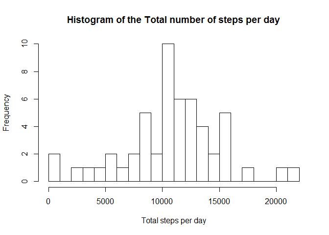
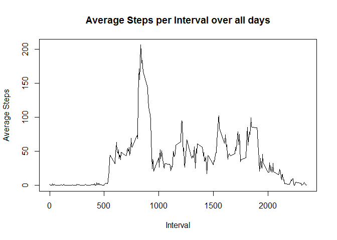
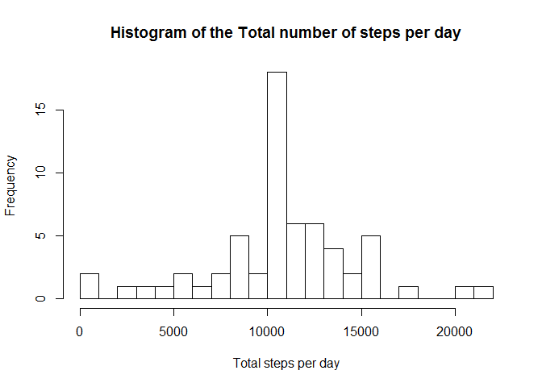

## Loading and preprocessing the data

Loading the data:


```r
data <- read.csv(unz("activity.zip", "activity.csv"))
```

A short summary of the data gives us an overview of the dataset:

```r
summary(data)
```

```
##      steps                date          interval     
##  Min.   :  0.00   2012-10-01:  288   Min.   :   0.0  
##  1st Qu.:  0.00   2012-10-02:  288   1st Qu.: 588.8  
##  Median :  0.00   2012-10-03:  288   Median :1177.5  
##  Mean   : 37.38   2012-10-04:  288   Mean   :1177.5  
##  3rd Qu.: 12.00   2012-10-05:  288   3rd Qu.:1766.2  
##  Max.   :806.00   2012-10-06:  288   Max.   :2355.0  
##  NA's   :2304     (Other)   :15840
```

The summary shows that there are some NA values in the **steps** variable, so we can
preprocess the dataset to remove these values:


```r
ok <- complete.cases(data)
dataWithoutNA <- data[ok, ]
dataWithoutNA$date <- factor(dataWithoutNA$date)
```


## What is mean total number of steps taken per day?
For this part of the analysis we use the dataWithoutNA data frame (i.e. the 
dataset without the NA values).

1. Calculation of the total number of steps taken per day:

```r
totalStepsPerDay <- tapply(dataWithoutNA$steps, dataWithoutNA$date, FUN=sum)
```

2. Histogram of the total number of steps taken each day

```r
hist(totalStepsPerDay, breaks = 20,
     main='Histogram of the Total number of steps per day',
     xlab='Total steps per day')
```

<!-- -->

3. Calculation of the **mean** and **median** of the total number of steps taken per day

```r
mean(totalStepsPerDay)
```

```
## [1] 10766.19
```

```r
median(totalStepsPerDay)
```

```
## [1] 10765
```


## What is the average daily activity pattern?

1. A time series plot of the 5-minute interval (x-axis) and the average number of steps taken, averaged across all days (y-axis):


```r
avgStepsPerInterval <- aggregate( dataWithoutNA$steps ~ dataWithoutNA$interval, FUN = mean )
plot(avgStepsPerInterval[[1]],
     avgStepsPerInterval[[2]],
     type='l', 
     xlab = 'Interval', ylab = 'Average Steps',
     main='Average Steps per Interval over all days')
```

<!-- -->

2. Interval with the maximum number of steps, on average across all the days in the dataset:


```r
maxSteps <- max(avgStepsPerInterval[[2]])
intervalMaxSteps <- avgStepsPerInterval[avgStepsPerInterval[[2]] == maxSteps,1]
intervalMaxSteps
```

```
## [1] 835
```


The interval **835** contains maximum number of steps.

## Imputing missing values

1. Total number of missing values in the dataset:


```r
naCount <- sum(!ok)
naCount
```

```
## [1] 2304
```

There are 2304 missing values in the dataset.  
(NOTE that the *ok* variable was calculated at the beggining of this analysis,
in the preprocessing step)  

2. Creation of a new dataset equal to the original one but with the missing data filled in.

The strategy that was used for filling in the missing values in the dataset was
the mean for the corresponding 5-minute interval.


```r
dataImputed <- data;
dataImputed <- transform(dataImputed, 
                          steps = ifelse(is.na(steps), 
                          ave(steps, interval, FUN = function(x) mean(x, na.rm = TRUE)), 
                          steps))
```


  
3. Histogram of the total number of steps taken each day:

```r
totalStepsPerDayIMPUTED <- tapply(dataImputed$steps, dataImputed$date, FUN=sum)
hist(totalStepsPerDayIMPUTED, breaks = 20,
     main='Histogram of the Total number of steps per day',
     xlab='Total steps per day')
```

<!-- -->


4. The mean and median total number of steps taken per day:

```r
mean(totalStepsPerDayIMPUTED)
```

```
## [1] 10766.19
```

```r
median(totalStepsPerDayIMPUTED)
```

```
## [1] 10766.19
```

The mean value didn't change from before and the median got equal to the mean.
The imputing of the missing data doesn't change the mean daily number of steps.


## Are there differences in activity patterns between weekdays and weekends?
  
  
1. Creation of a new factor variable in the dataset with two levels - "weekday" and "weekend" indicating whether a given date is a weekday or weekend day:


```r
dataImputed$day <- ifelse(grepl("S(at|un)", weekdays(as.Date(dataImputed$date), abbr = TRUE)), "weekend", "weekday") 
```
  
  
2. A panel plot containing a time series plot of the 5-minute interval (x-axis) and the average number of steps taken, averaged across all weekday days or weekend days (y-axis):


```r
meanWeekInterval <- aggregate(steps ~ interval + day, dataImputed,  FUN = mean)

library(lattice)
xyplot(steps~interval|factor(day),
       data = meanWeekInterval,
       type='l',layout=c(1,2),
       xlab='Interval',ylab='Number of Steps')
```

<!-- -->
